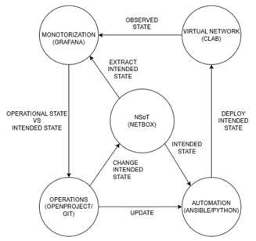
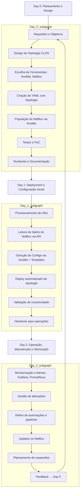

# Ambiente de Datacenter e automação de tarefas

Este projeto propõe a implementação de uma rede de data center baseada na arquitetura CLOS (Spine-Leaf), utilizando tecnologias como EVPN-VXLAN para segmentação de redes virtuais sobre uma infraestrutura L3.

Com foco na automação, a solução recorre ao Ansible, scripts de Python e templates Jinja2 para a orquestração de configurações e ao NetBox como fonte central de informação da infraestrutura de rede. Recorre tambem às ferramentas Prometheus e Grafana para monotorização da rede.

## Configuração

A configuração é dividida em duas partes: Configração do Netbox com os equipamentos e outras informações usadas na rede(Ex.: ASNs, VRFs, etc) e a configuração dos dispositivos do containerLab.

###  Configração do Netbox

A configuração do netbox é feita a partir dos playbooks Ansible disponiveis na diretoria [`Populate`](/Populate). Este playbooks tem de ser alterados manualmente para a a introdução de novos dados, caso por exemplo seja necessario acrescentar um novo router a topologia será necessario ir ao ficheiro device.yml, adicionar esse router novo com as suas informações pretendidas e correr o playbook [`devices.yml`](/Populate/devices.yml).

Para o inicio da topologia temos o ficheiro [`main.yml`](/Populate/main.yml) que faz a população do netbox com 5 equipamentos e as suas informações necessarias.

### Configuração dos Dispositivos no containerLab

A configuração da topologia no containerLab é feita a partir das informações fornecidas pelo Netbox.

O acesso do Netbox é feito a partir de playbooks Ansible que acessam ao API da Netbox retirando a informação pretinente, que é usada em conjunto com templates Jinja2 para a criação dos vars_files que contem toda a infomraçao necessaria para a configuração dos dispositivos SR Linux usados na na nossa [`topologia.clab.yml`](topologia.clab.yml).

Os playbooks foram feitos de forma dinamica, ou seja, qualquer alteração no Netbox irá alterar os vars_files.

Para fazer a configuração é usado apenas o ficheiro [`main.yml`](/Automation-srlinux/main.yml) presente na diretoria [`Automation-srlinux`](/Automation-srlinux).

## Organização por fases

