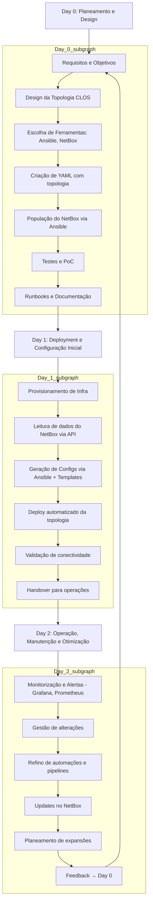

```mermaid
flowchart TD
  %% Título como nó separado para Day 0
  title0[Day 0: Planeamento e Design]

  subgraph Day_0_subgraph
    A1[Requisitos e Objetivos]
    A2[Design da Topologia CLOS]
    A3[Escolha de Ferramentas: Ansible, NetBox]
    A4[Criação de YAML com topologia]
    A5[População do NetBox via Ansible]
    A6[Testes e PoC]
    A7[Runbooks e Documentação]
    A1 --> A2 --> A3 --> A4 --> A5 --> A6 --> A7
  end

  title0 --> A1

  %% Day 1
  title1[Day 1: Deployment e Configuração Inicial]

  subgraph Day_1_subgraph
    B1[Provisionamento de Infra]
    B2[Leitura de dados do NetBox via API]
    B3[Geração de Configs via Ansible + Templates]
    B4[Deploy automatizado da topologia]
    B5[Validação de conectividade]
    B6[Handover para operações]
    B1 --> B2 --> B3 --> B4 --> B5 --> B6
  end

  A7 --> title1
  title1 --> B1

  %% Day 2
  title2[Day 2: Operação, Manutenção e Otimização]

  subgraph Day_2_subgraph
    C1[Monitorização e Alertas - Grafana, Prometheus]
    C2[Gestão de alterações]
    C3[Refino de automações e pipelines]
    C4[Updates no NetBox]
    C5[Planeamento de expansões]
    C6[Feedback → Day 0]
    C1 --> C2 --> C3 --> C4 --> C5 --> C6
  end

  B6 --> title2
  title2 --> C1
  C6 --> A1

```
